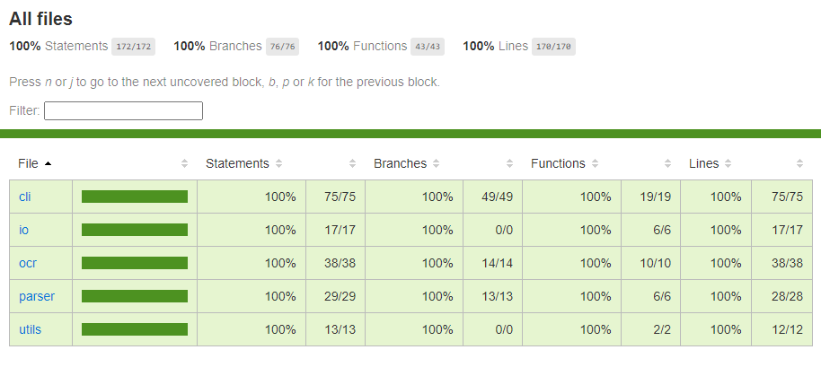
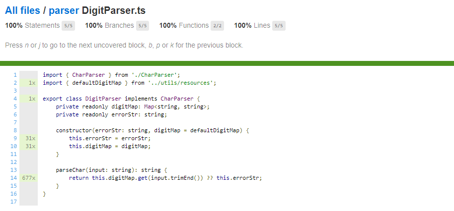
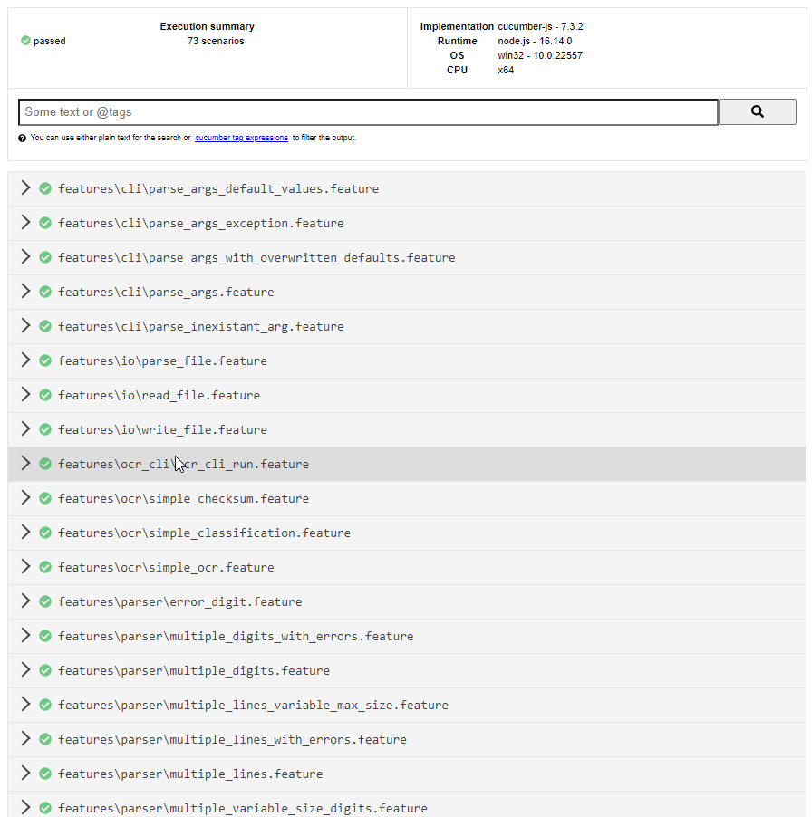
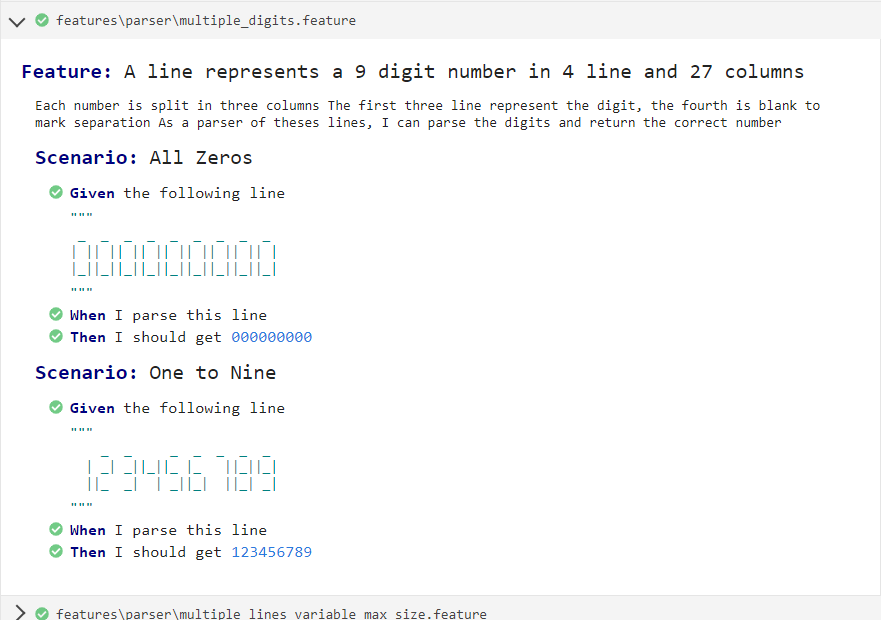

# Clean Code OCR

## Subject

### User Story 1

The input format created by the machine is as follows:

```
    _  _     _  _  _  _  _ 
  | _| _||_||_ |_   ||_||_|
  ||_  _|  | _||_|  ||_| _|
  
```

Each entry is exactly **4 rows and 27 columns** (9 x 3).
The first three lines describe numbers using pipes and underscores.
The fourth line is blank.

Each entry or **code** created has 9 digits, each ranging from 0 to 9.
A typical file can contain up to 100 entries.

Write a program that takes this file as input and manages to parse the codes contained.

### User Story 2

Sometimes the machine generates wrong codes.
You should now be able to validate the codes using a checksum.
It can be calculated as follows:

code     : 3 5 6 6 0 9 7 0 1
position : p9 p8 p7 p6 p5 p4 p3 p2 p1

checksum computing : 
((1*p1) + (2*p2) + (3*p3) + ... + (9*p9)) mod 11 == 0

### User Story 3

Your manager wants the results of your program.
It asks you to write an output file, for each of the input files, on this format :

457508000 
664371495 ERR

The output file has one code per line.
If the checksum is bad, it is indicated by ERR in a second column indicating the status.

### User Story 4

Sometimes the machine produces unreadable numbers, such as the following :

```
    _  _     _  _  _  _  _ 
  | _|  |  | _||_   ||_|| |
  ||_  _|  | _||_|  ||_| _|
  
```

Your program should be able to spot such problems.
In this case, the unknown numbers are replaced by '?'.
Update your file output. With the previous unreadable number, this would give :

457508000    
664371495 ERR   
12?13678? ILL

### User Story 5

Your manager would like to do some classification.
For a set of files given as input, he would now like to have the possibility of:

- Either keep the current behavior and create an output file for each input file
- Or use a new behavior that allows it to "group" similar codes

This behavior is as follows: Regardless of the number of input files, the program will create 3 outputs named
authorized, errored, and unknown

Authorized contains all valid checksums
Errored contains all invalid checksums
Unknown contains all unreadable checksums

### User Story 6

Provide a command tool to other developers in your company so they can easily use all
the features you just created.

Its implementation is free.

## Implementation

### Usage

You can run few commands to start/build this app :

- `npm run start` : Run compiled app in **dist** folder.
- `npm run build` : Compile the app and generate **dist** folder
- `npm run build-dev` :  Compile the app and generate **dist** folder then run it ( build + start )
- `npm run dev` : Directly run the TS source project
- `npm run test` : Run cucumber tests. This generates two report :
    - One in **coverage** folder which show the test coverage
    - One in **cucumber_report.html** at the root of the project that show how cucumber tests results
- `npm run lint` : Run `Eslint` on source code

#### Run command, arguments

When running the program, there is a few (optional) arguments that we can use :

- **h** (optional): ***boolean*** => display help
- **s** (optional, default=false): ***boolean*** => split classifier into multiple files
- **m** (optional, default=100): ***number*** => set the max number of lines to process
- **l** (optional, default=9): ***number*** => number of digits per lines
- **i** (optional, default='input.txt'): ***string*** => input filename
- **v** (optional): ***string*** => valid output filename
- **e** (optional): ***string*** => error output filename
- **u** (optional): ***string*** => unreadable output filename

### Classes

The main class is probably the one that can parse each line, regarding the given schema :

```typescript
interface Parser {
    parseText(text: string, maxLines: number, lineSize: number): string[];

    parseLine(line: string, length: number): string;
}
```

This class consists in splitting each character, and it uses another class to get the parsed char :

```typescript
interface CharParser {
    parseChar(input: string): string;
}
```

To be able to match the digit correctly, we are using a string map :

```typescript
const defaultDigitMap: Map<string, string> = new Map([
    [' _\n| |\n|_|', '0'],
    ['\n  |\n  |', '1'],
    [' _\n _|\n|_', '2'],
    [' _\n _|\n _|', '3'],
    ['\n|_|\n  |', '4'],
    [' _\n|_\n _|', '5'],
    [' _\n|_\n|_|', '6'],
    [' _\n  |\n  |', '7'],
    [' _\n|_|\n|_|', '8'],
    [' _\n|_|\n _|', '9'],
]);
```

To allow the user to choose the way the outputs are classified, we use the following class to return a said output destination for a given state :
```typescript
export interface Classifier {
    getDestination(lineState: LineState): string;
}
```

The user can choose between two predefined classifiers, the default one is the unified classifier :
```typescript
export const splitClassifierStateAssociation: Map<LineState, string> = new Map([
    [LineState.VALID, 'authorized.txt'],
    [LineState.ERROR, 'errored.txt'],
    [LineState.UNREADABLE, 'unknown.txt'],
]);
export const unifiedClassifierStateAssociation: Map<LineState, string> =
    new Map([
        [LineState.VALID, 'output.txt'],
        [LineState.ERROR, 'output.txt'],
        [LineState.UNREADABLE, 'output.txt'],
    ]);
```
### Tests & Coverage

When we run the cucumber tests, it generates two reports

#### Coverage Report

The first one is a code coverage on cucumber's tests. This file is viewable on **coverage/index.html** and look like
this :



#### Cucumber report

The other report is the result of the ran cucumber's tests :





